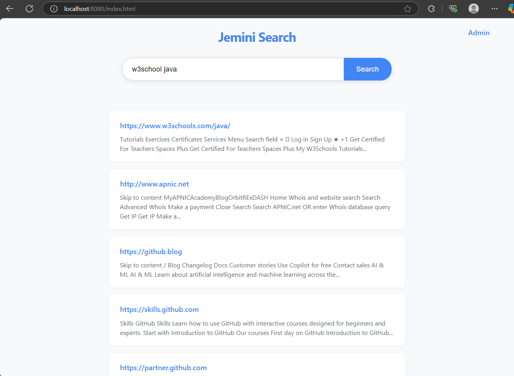

# Spring Boot Web Crawler and Search Engine

This project provides a REST API that allows users to submit URLs for crawling. The app internally uses RabbitMQ to publish the URLs, and then listens back to fetch the contents of the URLs using Jsoup. The content is indexed using multiple strategies including Apache Lucene and Elasticsearch. The app also scrapes links and recursively publishes them to RabbitMQ for further crawling.

In addition, the app provides a search API that allows users to submit queries and retrieve the top 10 pages based on the best match. This app can also be used to crawl internal portals and search within them.



## Running the Application
To run the application, you will need Docker and Docker Compose installed on your local machine.

1. Clone the repository to your local machine.
2. Navigate to the project directory in the terminal.
3. Run the following command to start the application:
```shell
./start.sh  # Make sure to give execution permission
```
4. This will start the RabbitMQ server, build and start the Docker containers for the Spring Boot application, and set up the necessary environment variables.
5. Once the application is running, you can submit URLs to the `/api/crawl` endpoint and queries to the `/api/search` endpoint.

Note: If you encounter any issues while running the application, please refer to the logs generated by Docker Compose.

## Technologies used
- Spring Boot
- RabbitMQ
- Jsoup
- Multiple indexing strategies:
    - Apache Lucene
    - Elasticsearch
    - LLM-based indexing
- Vector databases for semantic search:
    - Qdrant
    - Chroma
- Local Embedding Services

## Usage
1. Clone the repository to your local machine.
2. Open the project in your preferred IDE.
3. Build and run the application.
4. Submit URLs to the `/api/crawl` endpoint.
5. Submit queries to the `/api/search?q=` endpoint.
6. Use the web interface by accessing the root URL of the application or the admin interface at `/admin.html`.

## Contributing
1. Fork the repository.
2. Create a new branch for your feature or bugfix.
3. Make your changes and test them thoroughly.
4. Submit a pull request.

## License
This project is licensed under the Apache License 2.0. See the [LICENSE](LICENSE) file for details.